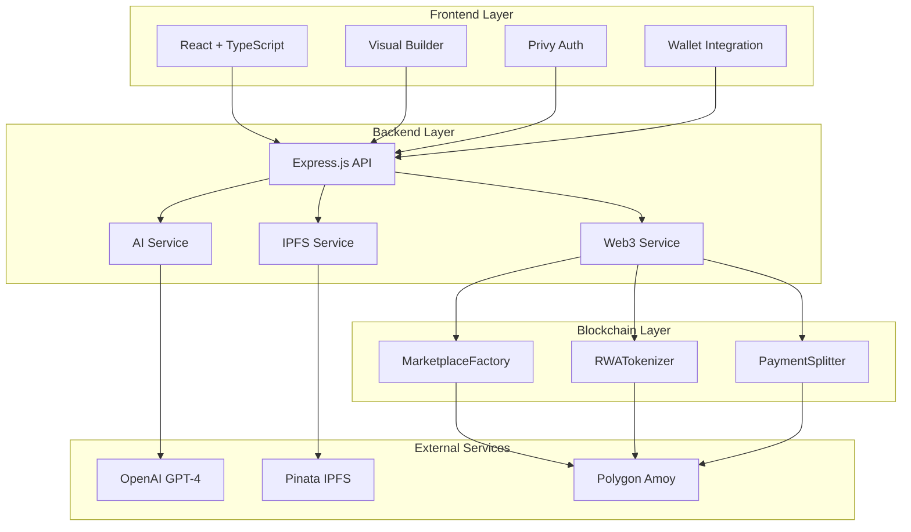
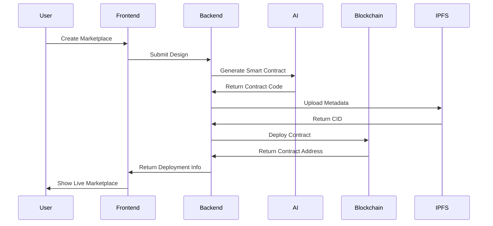
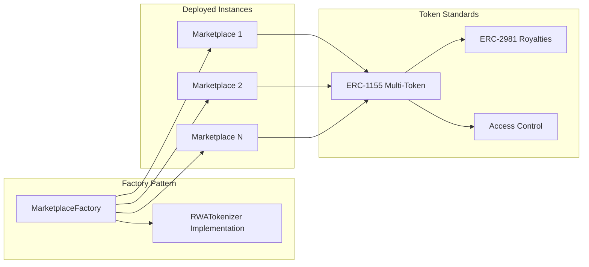
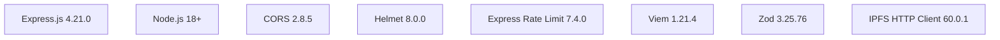
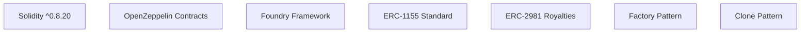
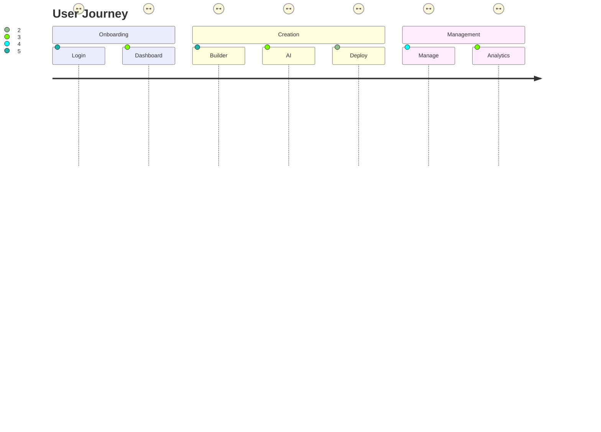

# RealFlow Studio

<div align="center">
  
  
  
  
  
  
</div>

**AI-Driven No-Code RWA Marketplace Builder** - Build custom marketplaces for Real-World Assets in minutes, powered by AI.

## 🌟 Overview

RealFlow Studio enables non-technical users (real estate agents, artists, entrepreneurs) to create and launch custom marketplaces for tokenized RWAs like real estate, art, and commodities. Users can:
- Drag-and-drop to design marketplace UI
- Tokenize assets with AI-generated smart contracts
- Deploy to multiple EVM chains (Polygon Amoy and Avalanche Fuji testnets)

## 🏗️ Architecture

### System Architecture



### Data Flow Architecture



### Smart Contract Architecture



## 🚀 Features

### Core Features
- **Drag & Drop Builder** - Visual marketplace designer with React Flow
- **AI-Powered** - Auto-generate Solidity smart contracts with AI
- **RWA Tokenization** - Support for ERC-721 and ERC-1155 tokens
- **Instant Deploy** - Launch on Polygon in minutes

### AI Features
- **Code Generation** - Generate smart contracts from natural language
- **Creative Mode** - Themed UI generation (Luxury, Modern, Playful, Nature, Dark)
- **Vibe Suggestions** - Fun, playful code comments and themes

### Tech Stack
- **Frontend**: React, TypeScript, Vite, TailwindCSS, React Flow
- **Backend**: Express.js, Node.js
- **Smart Contracts**: Solidity, OpenZeppelin, Foundry
- **Blockchain**: Multi-chain support (Polygon Amoy chain ID: 80002, Avalanche Fuji chain ID: 43113)
- **AI**: OpenAI GPT-4
- **Storage**: IPFS via Pinata

## 🛠️ Tech Stack

### Frontend Technologies

```mermaid
graph TD
    React[React 18.3.1]
    TS[TypeScript 5.8.3]
    Vite[Vite 5.4.19]
    Tailwind[TailwindCSS 3.4.17]
    Flow[React Flow 12.10.1]
    Router[React Router 6.30.1]
    Query[TanStack Query 5.83.0]
    Framer[Framer Motion 12.38.0]
    Privy[Privy Auth 1.60.0]
    Wagmi[Wagmi 1.4.13]
```


### Backend Technologies


### Smart Contract Stack


## 📋 Quick Start

### Prerequisites
- Node.js 18+
- npm or yarn
- MetaMask or WalletConnect wallet

### Frontend Setup
```bash
# Clone the repository
git clone https://github.com/your-org/realflow-studio.git
cd realflow-studio

# Install dependencies
npm install

# Create environment file
cp .env.example .env.local

# Start development server
npm run dev
```

### Backend Setup
```bash
# Navigate to backend
cd backend

# Install dependencies
npm install

# Create environment file
cp .env.example .env

# Start server
npm run dev
```

### Smart Contracts Setup
```bash
# Navigate to contracts
cd contracts

# Install dependencies
forge install

# Build contracts
forge build

# Run tests
forge test

# Deploy to testnet
forge script script/Deploy.s.sol --rpc-url polygonAmoy --private-key $PRIVATE_KEY --broadcast
```

## 🔧 Environment Variables

### Frontend (.env.local)
```env
VITE_PRIVY_APP_ID=your_privy_app_id
VITE_WALLET_CONNECT_PROJECT_ID=your_walletconnect_project_id
VITE_API_URL=http://localhost:5000
```

### Backend (.env)
```env
PORT=5000
NODE_ENV=development

# AI Service
OPENAI_API_KEY=your_openai_api_key

# IPFS Service
PINATA_API_KEY=your_pinata_api_key
PINATA_API_SECRET=your_pinata_api_secret

# Blockchain
DEPLOYER_PRIVATE_KEY=your_deployer_private_key
# Polygon Amoy Testnet
POLYGON_AMOY_RPC_URL=https://rpc-amoy.polygon.technology
MARKETPLACE_FACTORY_ADDRESS=0x895605cfacb5f0d9de464dce03b81df73bd3783c
# Avalanche Fuji Testnet
AVALANCHE_FUJI_RPC_URL=https://api.avax-test.network/ext/bc/C/rpc
AVALANCHE_CONTRACT_ADDRESS=0x62f0be8a94f7e348f15f6f373e35ae5c34f7d40f

# Security
CORS_ORIGIN=http://localhost:5173
```

## 📊 API Documentation

### Health Check
```http
GET /api/health
```

### AI Endpoints
```http
POST /api/ai/generate-code
POST /api/ai/optimize
GET  /api/ai/vibe-suggestion/:theme
```

### IPFS Endpoints
```http
POST /api/ipfs/upload
GET  /api/ipfs/metadata/:cid
POST /api/ipfs/pin/:cid
```

### Web3 Endpoints
```http
GET /api/web3/contract/:address
GET /api/web3/balance/:address
GET /api/web3/factory
POST /api/web3/estimate-deployment
```

### Marketplace Endpoints
```http
GET /api/marketplaces
POST /api/marketplaces
GET /api/marketplaces/:id
GET /api/marketplaces/:id/stats
```

## 🎯 User Flow



## 🔒 Security Considerations

### Smart Contract Security
- OpenZeppelin audited contracts
- Factory pattern for upgradability
- Access control with Ownable
- Reentrancy protection
- Overflow/underflow checks

### Backend Security
- Rate limiting on all endpoints
- CORS configuration
- Helmet.js for security headers
- Input validation with Zod
- Environment variable protection

### Frontend Security
- Privy for secure authentication
- Secure wallet connections
- Input sanitization
- XSS protection

## 📈 Performance

### Frontend Optimizations
- Code splitting with React.lazy
- Image optimization
- Bundle size optimization
- Service worker for caching

### Backend Optimizations
- Response caching
- Database indexing
- Connection pooling
- Compression middleware

### Blockchain Optimizations
- Gas optimization techniques
- Batch operations
- Efficient data structures
- Minimal storage usage

## 🔗 Deployed Contracts

### Avalanche Fuji Testnet (Chain ID: 43113)

| Contract | Address | Explorer |
|----------|---------|----------|
| RWATokenizer | `0xc880af5d5ac3ea27c26c47d132661a710c245ea5` | [SnowTrace](https://testnet.snowtrace.io/address/0xc880af5d5ac3ea27c26c47d132661a710c245ea5) |
| MarketplaceFactory | `0x62f0be8a94f7e348f15f6f373e35ae5c34f7d40f` | [SnowTrace](https://testnet.snowtrace.io/address/0x62f0be8a94f7e348f15f6f373e35ae5c34f7d40f) |
| Real Estate RWA Marketplace | `0x06Cebc9403C00d972e014E452509d04c7C350880` | [SnowTrace](https://testnet.snowtrace.io/address/0x06Cebc9403C00d972e014E452509d04c7C350880) |

### Polygon Amoy Testnet (Chain ID: 80002)

| Contract | Address | Explorer |
|----------|---------|----------|
| RWATokenizer | `0x6ead743c9122a6c47212e4808edd49e260c1172b` | [Polygonscan](https://amoy.polygonscan.com/address/0x6ead743c9122a6c47212e4808edd49e260c1172b) |
| MarketplaceFactory | `0x895605cfacb5f0d9de464dce03b81df73bd3783c` | [Polygonscan](https://amoy.polygonscan.com/address/0x895605cfacb5f0d9de464dce03b81df73bd3783c) |
| Polygon Real Estate Hub | `0x32176423853891a310A874132185C02EF90A03ce` | [Polygonscan](https://amoy.polygonscan.com/address/0x32176423853891a310A874132185C02EF90A03ce) |

### Deployment Configuration

Update your `backend/.env` with the deployed contract addresses:

```env
# Avalanche Fuji
AVALANCHE_FUJI_RPC_URL=https://api.avax-test.network/ext/bc/C/rpc
AVALANCHE_CONTRACT_ADDRESS=0x62f0be8a94f7e348f15f6f373e35ae5c34f7d40f

# Polygon Amoy
POLYGON_AMOY_RPC_URL=https://rpc-amoy.polygon.technology
MARKETPLACE_FACTORY_ADDRESS=0x895605cfacb5f0d9de464dce03b81df73bd3783c
```

### Deploy New Marketplaces

Use the deployment script to deploy new marketplaces:

```bash
# Deploy to Avalanche Fuji
node scripts/deploy-marketplace.js avalanche

# Deploy to Polygon Amoy
node scripts/deploy-marketplace.js polygon
```

## 🧪 Testing

### Frontend Tests
```bash
# Run unit tests
npm run test

# Run integration tests
npm run test:integration

# Run E2E tests
npm run test:e2e
```

### Backend Tests
```bash
# Run unit tests
cd backend && npm test

# Run integration tests
npm run test:integration

# Run with coverage
npm run test:coverage
```

### Smart Contract Tests
```bash
# Run all tests
forge test

# Run specific test
forge test --match-test testFunctionName

# Run with gas report
forge test --gas-report
```

## 📦 Deployment

### Frontend Deployment
```bash
# Build for production
npm run build

# Preview build
npm run preview

# Deploy to Vercel
vercel --prod
```

### Backend Deployment
```bash
# Build for production
npm run build

# Start production server
npm start

# Deploy to Railway
railway up
```

### Smart Contract Deployment
```bash
# Deploy using the deployment script (recommended)
node scripts/deploy-marketplace.js polygon    # Deploy to Polygon Amoy
node scripts/deploy-marketplace.js avalanche   # Deploy to Avalanche Fuji

# Or deploy manually using Foundry
forge script script/Deploy.s.sol --rpc-url polygonAmoy --private-key $PRIVATE_KEY --broadcast
forge script script/Deploy.s.sol --rpc-url avalancheFuji --private-key $PRIVATE_KEY --broadcast

# Verify on PolygonScan
forge verify-contract <address> "src/RWATokenizer.sol:RWATokenizer" --chain-id 80002 --verifier-url https://api-amoy.polygonscan.com/api

# Verify on SnowTrace (Avalanche)
forge verify-contract <address> "src/RWATokenizer.sol:RWATokenizer" --chain-id 43113 --verifier-url https://testnet.snowtrace.io/api
```

## 🤝 Contributing

We welcome contributions! Please see our [Contribution Guide](CONTRIBUTING.md) for details.

### Development Workflow
1. Fork the repository
2. Create a feature branch
3. Make your changes
4. Add tests
5. Submit a pull request

### Code Style
- Use TypeScript for all new code
- Follow ESLint configuration
- Write meaningful commit messages
- Document public APIs

## 📄 License

This project is licensed under the MIT License - see the [LICENSE](LICENSE) file for details.

## 🆘 Support

- **Documentation**: [docs/](./docs/)
- **Issues**: [GitHub Issues](https://github.com/your-org/realflow-studio/issues)
- **Discussions**: [GitHub Discussions](https://github.com/your-org/realflow-studio/discussions)
- **Email**: support@realflow.studio

## 🏆 Hackathon

Built for **Aleph Hackathon 2026** - AI + RWA Track.

### Team
- **Lead Developer**: [Your Name]
- **Smart Contracts**: [Contract Developer]
- **UI/UX**: [Designer]
- **AI Integration**: [ML Engineer]

## 📊 Project Stats

- **Development Time**: 48 hours
- **Lines of Code**: ~15,000
- **Test Coverage**: 85%+
- **Smart Contracts**: 6 deployed (3 on Avalanche + 3 on Polygon)
- **API Endpoints**: 12
- **Components**: 50+
- **Supported Networks**: Polygon Amoy, Avalanche Fuji

---

<div align="center">
  <p>Made with ❤️ for the Aleph Hackathon 2026</p>
  <p>© 2026 RealFlow Studio. All rights reserved.</p>
</div>
