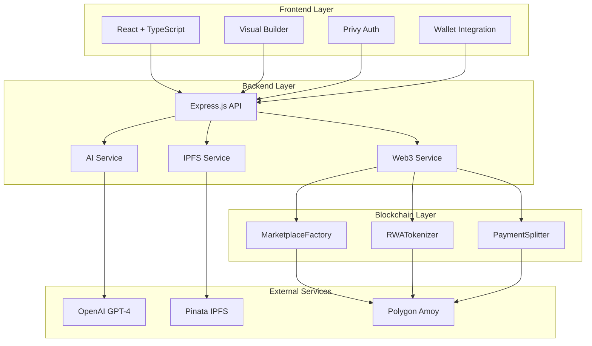
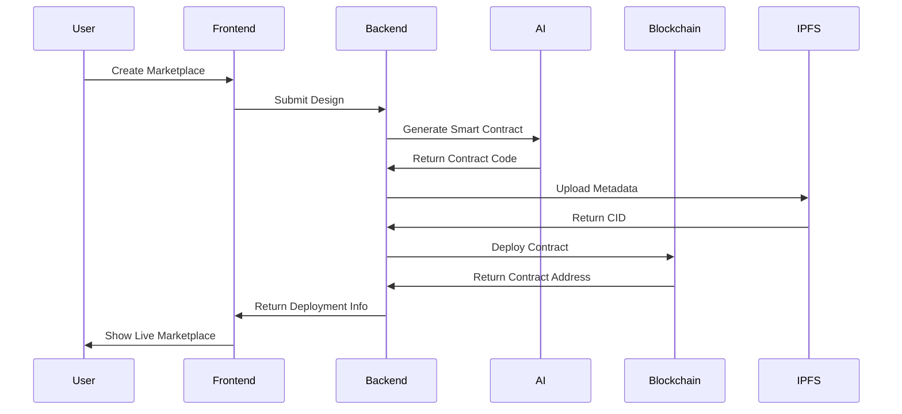
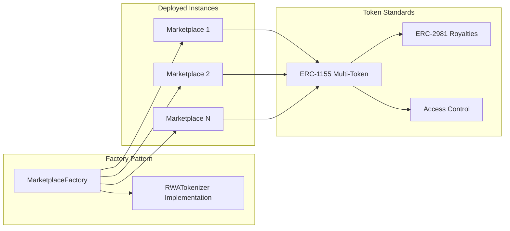
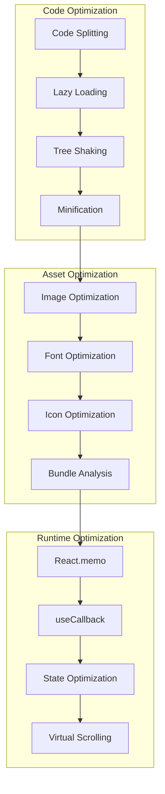
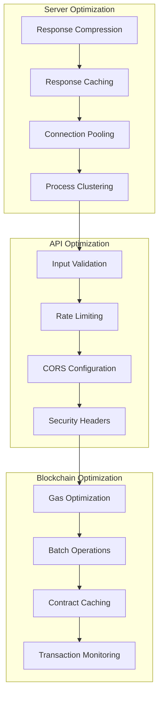

# RealFlow Studio Architecture

## 🏗️ System Overview

RealFlow Studio is a comprehensive platform for building and deploying RWA (Real-World Asset) marketplaces without writing code. The architecture follows a modern, scalable approach with clear separation of concerns.

## 📐 High-Level Architecture



## 🎨 Detailed Architecture Diagram

```
┌─────────────────────────────────────────────────────────────────┐
│                         FRONTEND (React)                         │
│  ┌─────────────┐  ┌─────────────┐  ┌─────────────────────────┐  │
│  │   Pages     │  │  Components │  │        Hooks            │  │
│  │  - Index    │  │  - Builder  │  │  - useAuth              │  │
│  │  - Dashboard│  │  - AI       │  │  - useAI                 │  │
│  │  - Builder  │  │  - UI       │  │  - useToast              │  │
│  └─────────────┘  └─────────────┘  └─────────────────────────┘  │
│         │                │                    │                 │
│         └────────────────┼────────────────────┘                 │
│                          │                                      │
│  ┌───────────────────────┴───────────────────────────────────┐  │
│  │                   React Flow Canvas                        │  │
│  │   ┌──────────┐     ┌──────────┐     ┌──────────┐          │  │
│  │   │ Asset    │────▶│ Token   │────▶│ Listing  │          │  │
│  │   │ Upload   │     │ Mint     │     │ Grid     │          │  │
│  │   └──────────┘     └──────────┘     └──────────┘          │  │
│  └───────────────────────────────────────────────────────────┘  │
└─────────────────────────────────────────────────────────────────┘
                              │ HTTP
                              ▼
┌─────────────────────────────────────────────────────────────────┐
│                      BACKEND (Express)                          │
│  ┌──────────────┐  ┌──────────────┐  ┌──────────────┐          │
│  │    Routes    │  │   Services   │  │   Middleware │          │
│  │  - /api/ai   │  │  - AI        │  │  - CORS      │          │
│  │  - /api/ipfs │  │  - IPFS      │  │  - Rate Limit│          │
│  │  - /api/web3 │  │  - Web3      │  │  - Helmet    │          │
│  └──────────────┘  └──────────────┘  └──────────────┘          │
└─────────────────────────────────────────────────────────────────┘
         │                    │                    │
         ▼                    ▼                    ▼
┌─────────────────┐  ┌─────────────────┐  ┌─────────────────┐
│   OpenAI API    │  │  IPFS/Pinata    │  │   Polygon RPC    │
│   (Code Gen)    │  │  (Metadata)     │  │   (Blockchain)   │
└─────────────────┘  └─────────────────┘  └─────────────────┘
                                                        │
                                                        ▼
┌─────────────────────────────────────────────────────────────────┐
│                   SMART CONTRACTS (Solidity)                   │
│  ┌─────────────────┐  ┌─────────────────┐  ┌─────────────────┐│
│  │ RWATokenizer    │  │ Marketplace     │  │ Marketplace     ││
│  │ (ERC-721/1155)  │  │ Factory         │  │ Contract        ││
│  └─────────────────┘  └─────────────────┘  └─────────────────┘│
└─────────────────────────────────────────────────────────────────┘
```

## Component Architecture

```
┌─────────────────────────────────────────────────────────────────┐
│                         Provider Stack                           │
│  ┌─────────────────────────────────────────────────────────────┐│
│  │ WagmiConfig (Web3)                                          ││
│  │   └── PrivyProvider (Auth)                                   ││
│  │         └── QueryClient (Data Fetching)                      ││
│  │               └── App                                       ││
│  └─────────────────────────────────────────────────────────────┘│
└─────────────────────────────────────────────────────────────────┘
```

## 🔄 Data Flow Architecture



## 📊 State Management Flow

```
User Action → Component → Hook → Service → API → Response → State Update
     │                    │
     ▼                    ▼
  UI Update         Optimistic Update
```

## 🔗 Smart Contract Architecture



## 🔒 Security Architecture

```mermaid
graph TB
    subgraph "Frontend Security"
        Privy[Privy Auth]
        Session[JWT Session]
        Storage[Secure Storage]
        Validation[Input Validation]
    end
    
    subgraph "Backend Security"
        RateLimit[Rate Limiting]
        CORS[CORS Policy]
        Helmet[Security Headers]
        Encryption[Data Encryption]
    end
    
    subgraph "Blockchain Security"
        AccessControl[Access Control]
        Signature[Signature Verification]
        Reentrancy[Reentrancy Protection]
        Overflow[Overflow Checks]
    end
    
    Privy --> Session
    Session --> Storage
    Storage --> Validation
    
    RateLimit --> CORS
    CORS --> Helmet
    Helmet --> Encryption
    
    AccessControl --> Signature
    Signature --> Reentrancy
    Reentrancy --> Overflow
```



## 🚀 Performance Architecture

### Frontend Optimizations


### Backend Optimizations


## 📁 Key Files

| Path | Description |
|------|-------------|
| `src/main.tsx` | App entry, providers setup |
| `src/App.tsx` | Routes and layout |
| `src/pages/Builder.tsx` | Main builder canvas |
| `src/components/builder/*` | Builder components |
| `src/components/ai/*` | AI integration |
| `src/hooks/useAuth.ts` | Authentication hook |
| `src/hooks/useAI.ts` | AI conversation hook |
| `src/hooks/useWeb3.ts` | Web3 integration hooks |
| `src/services/contracts.ts` | Smart contract service |
| `backend/src/server.js` | Express server |
| `backend/src/routes/*` | API routes |
| `backend/src/services/*` | Business logic |
| `contracts/src/*.sol` | Smart contracts |

## 🔧 Technology Stack

### Frontend Technologies
- **React 18.3.1** - UI framework
- **TypeScript 5.8.3** - Type safety
- **Vite 5.4.19** - Build tool
- **TailwindCSS 3.4.17** - Styling
- **React Flow 12.10.1** - Visual builder
- **Framer Motion 12.38.0** - Animations
- **Privy 1.60.0** - Authentication
- **Wagmi 1.4.13** - Web3 integration

### Backend Technologies
- **Express.js 4.21.0** - API framework
- **Node.js 18+** - Runtime
- **Viem 1.21.4** - Ethereum client
- **Zod 3.25.76** - Schema validation
- **IPFS HTTP Client 60.0.1** - IPFS integration

### Smart Contracts
- **Solidity ^0.8.20** - Contract language
- **OpenZeppelin Contracts** - Secure libraries
- **Foundry** - Development framework
- **ERC-1155** - Multi-token standard
- **ERC-2981** - Royalty standard

### External Services
- **OpenAI GPT-4** - AI code generation
- **Pinata** - IPFS pinning service
- **Polygon Amoy** - Testnet blockchain
- **PolygonScan** - Block explorer

## 📈 Scalability Considerations

### Frontend Scaling
- Code splitting for lazy loading
- Component memoization
- Virtual scrolling for large lists
- Image optimization and CDN

### Backend Scaling
- Response caching
- Rate limiting
- Connection pooling
- Process clustering

### Blockchain Scaling
- Gas optimization techniques
- Batch operations
- Contract upgrade patterns
- Multi-chain support (future)

## 🔮 Future Architecture Plans

### Phase 2 - Q2 2026
- PostgreSQL database integration
- Real-time analytics dashboard
- Advanced monitoring system
- Mobile app development

### Phase 3 - Q3 2026
- Multi-chain support
- DeFi protocol integration
- DAO governance system
- Asset insurance protocols

### Phase 4 - Q4 2026
- Enterprise features
- Public API launch
- Developer SDK
- Feature marketplace

---

*Architecture documentation is continuously updated as the platform evolves.*  
*Last updated: March 2026*
