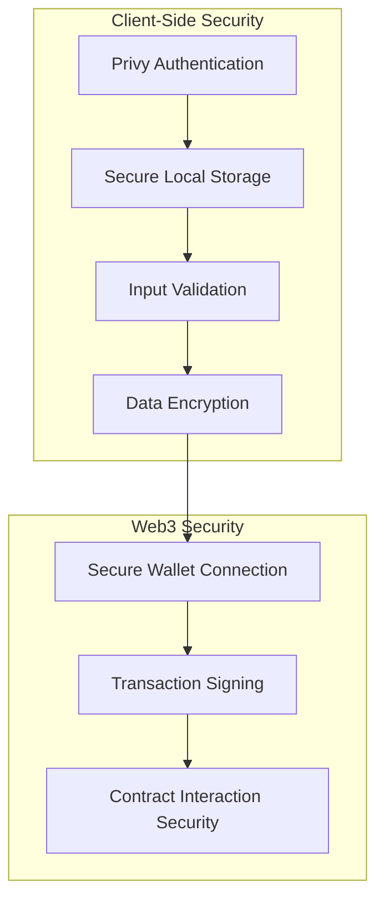
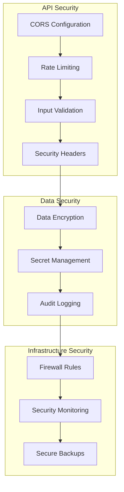
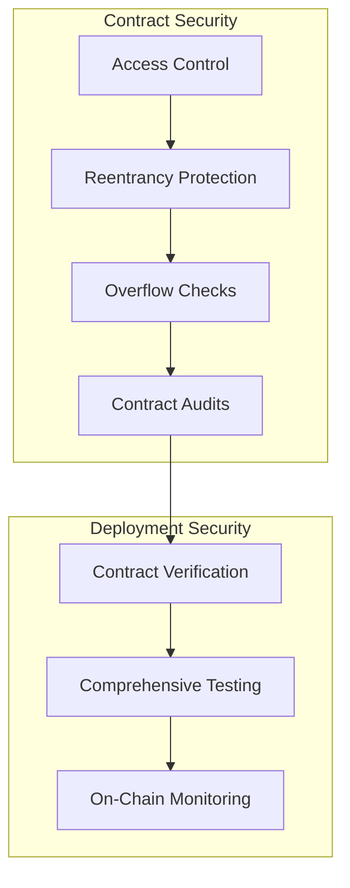

# Security Policy

## 🛡️ Security Overview

RealFlow Studio takes security seriously. This document outlines our security practices, vulnerability reporting process, and security considerations for the platform.

## 🔒 Security Principles

### Defense in Depth
- Multiple layers of security controls
- Redundant security mechanisms
- Continuous monitoring and improvement

### Least Privilege
- Minimal access permissions
- Role-based access control
- Secure default configurations

### Transparency
- Open source codebase
- Public security audits
- Clear vulnerability disclosure process

## 🔐 Security Architecture

### Frontend Security

### Backend Security

### Smart Contract Security

## 🔍 Security Features

### Authentication & Authorization
- **Privy Authentication**: Secure wallet-based authentication
- **Session Management**: Secure JWT token handling
- **Access Control**: Role-based permissions
- **Multi-factor Support**: Additional security layers

### Data Protection
- **Encryption**: AES-256 encryption for sensitive data
- **Hashing**: SHA-256 for password hashing
- **Secure Storage**: Encrypted local storage
- **Data Minimization**: Collect only necessary data

### API Security
- **Rate Limiting**: Prevent abuse and DoS attacks
- **Input Validation**: Comprehensive input sanitization
- **CORS Protection**: Secure cross-origin requests
- **Security Headers**: HTTP security headers via Helmet.js

### Smart Contract Security
- **OpenZeppelin**: Audited and secure contract libraries
- **Access Control**: Ownable and role-based permissions
- **Reentrancy Protection**: Prevent reentrancy attacks
- **Overflow Checks**: Prevent integer overflow/underflow

## 🚨 Vulnerability Reporting

### Reporting Process
1. **Do NOT open public issues** for security vulnerabilities
2. **Email us** at security@realflow.studio
3. **Provide detailed information** about the vulnerability
4. **Wait for our response** before disclosing publicly

### What to Include
- **Vulnerability Description**: Clear explanation of the issue
- **Steps to Reproduce**: Detailed reproduction steps
- **Impact Assessment**: Potential impact of the vulnerability
- **Proof of Concept**: Code or screenshots demonstrating the issue
- **Environment**: Version, browser, OS information

### Response Timeline
- **Initial Response**: Within 24 hours
- **Assessment**: Within 3 business days
- **Remediation**: As soon as possible, based on severity
- **Public Disclosure**: After fix is deployed

### Severity Levels
- **Critical**: Immediate risk to user funds or data
- **High**: Significant security impact
- **Medium**: Limited security impact
- **Low**: Minor security issue

## 🛡️ Security Best Practices

### For Users
- **Secure Your Wallet**: Use hardware wallets when possible
- **Strong Passwords**: Use unique, strong passwords
- **Two-Factor Authentication**: Enable 2FA when available
- **Phishing Awareness**: Beware of phishing attempts
- **Keep Software Updated**: Use latest browser and wallet versions

### For Developers
- **Code Review**: All code changes require security review
- **Dependency Management**: Keep dependencies updated
- **Secret Management**: Never commit secrets to version control
- **Testing**: Comprehensive security testing
- **Documentation**: Document security considerations

### For Operators
- **Access Control**: Limit access to production systems
- **Monitoring**: Continuous security monitoring
- **Backup**: Regular secure backups
- **Incident Response**: Have incident response plan
- **Compliance**: Follow security regulations

## 🔍 Security Audits

### Smart Contract Audits
- **Third-Party Audits**: Regular professional audits
- **Internal Reviews**: Comprehensive internal code reviews
- **Automated Testing**: Extensive automated security testing
- **Formal Verification**: Mathematical proofs where applicable

### Code Audits
- **Static Analysis**: Automated code analysis tools
- **Dynamic Analysis**: Runtime security testing
- **Penetration Testing**: External security testing
- **Dependency Scanning**: Scan for vulnerable dependencies

### Infrastructure Audits
- **Network Security**: Network configuration reviews
- **Access Controls: Access control audits
- **Data Protection**: Data handling and storage audits
- **Compliance**: Regulatory compliance checks

## 🚨 Incident Response

### Response Team
- **Security Lead**: Coordinates incident response
- **Engineering Team**: Implements fixes and mitigations
- **Communications**: Manages public communications
- **Legal**: Handles legal aspects of incidents

### Response Process
1. **Detection**: Identify security incident
2. **Assessment**: Evaluate impact and scope
3. **Containment**: Limit damage and prevent spread
4. **Eradication**: Remove threat and vulnerabilities
5. **Recovery**: Restore normal operations
6. **Lessons Learned**: Document and improve processes

### Communication
- **Internal Team**: Immediate notification
- **Users**: Transparent communication about impact
- **Public**: Appropriate public disclosure
- **Regulators**: Regulatory reporting when required

## 🔐 Security Considerations

### Smart Contract Risks
- **Private Key Security**: Secure private key management
- **Contract Upgrades**: Secure upgrade mechanisms
- **Gas Limit Issues**: Prevent gas limit exhaustion
- **Front-Running**: Protect against MEV attacks

### Platform Risks
- **API Security**: Secure API design and implementation
- **Data Privacy**: Protect user data and privacy
- **Availability**: Ensure platform availability
- **Scalability**: Secure scaling practices

### Integration Risks
- **Third-Party Services**: Secure integration practices
- **External APIs**: Validate and sanitize external data
- **Blockchain Networks**: Secure blockchain interactions
- **IPFS**: Secure decentralized storage

## 📊 Security Monitoring

### Real-time Monitoring
- **Anomaly Detection**: Identify unusual behavior
- **Transaction Monitoring**: Monitor blockchain transactions
- **Access Monitoring**: Track access patterns
- **Performance Monitoring**: Monitor system performance

### Logging and Auditing
- **Security Logs**: Comprehensive security logging
- **Audit Trails**: Complete audit trails
- **Log Analysis**: Regular log analysis
- **Retention**: Appropriate log retention policies

### Alerting
- **Security Alerts**: Automated security alerts
- **Threshold Alerts**: Alert on threshold breaches
- **Anomaly Alerts**: Alert on unusual patterns
- **Escalation**: Appropriate alert escalation

## 🔄 Security Updates

### Patch Management
- **Regular Updates**: Regular security updates
- **Emergency Patches**: Quick deployment for critical issues
- **Testing**: Thorough testing before deployment
- **Rollback**: Ability to rollback if needed

### Security Advisories
- **Public Advisories**: Public security advisories
- **Private Notifications**: Direct notifications to affected users
- **Mitigation Guidance**: Guidance on mitigating risks
- **Update Instructions**: Clear update instructions

## 🤝 Security Community

### Bug Bounty Program
- **Rewards**: Financial rewards for valid vulnerabilities
- **Recognition**: Public recognition for contributions
- **Scope**: Clearly defined scope of program
- **Rules**: Clear rules and guidelines

### Security Research
- **Responsible Disclosure**: Encourage responsible disclosure
- **Research Collaboration**: Collaborate with security researchers
- **Tool Development**: Develop security tools
- **Knowledge Sharing**: Share security knowledge

## 📞 Security Contact

### Report Security Issues
- **Email**: security@realflow.studio
- **PGP Key**: Available on request
- **Response Time**: Within 24 hours
- **Encryption**: Encrypted communications preferred

### General Security Inquiries
- **Email**: security@realflow.studio
- **Discord**: #security channel
- **GitHub**: Security discussions

### Emergency Contact
- **Critical Issues**: emergency@realflow.studio
- **24/7 Response**: For critical security incidents
- **Phone**: Available on request for critical issues

---

## 📋 Security Checklist

### Development
- [ ] Code reviewed for security issues
- [ ] Dependencies scanned for vulnerabilities
- [ ] Security tests written and passing
- [ ] Secrets properly managed
- [ ] Access controls implemented

### Deployment
- [ ] Security headers configured
- [ ] Rate limiting enabled
- [ ] Logging and monitoring enabled
- [ ] Backup procedures tested
- [ ] Incident response plan ready

### Operations
- [ ] Regular security audits scheduled
- [ ] Monitoring and alerting configured
- [ ] Security training completed
- [ ] Documentation up to date
- [ ] Compliance requirements met

---

*This security policy is regularly updated to reflect our evolving security practices.*  
*Last updated: March 22, 2026*
